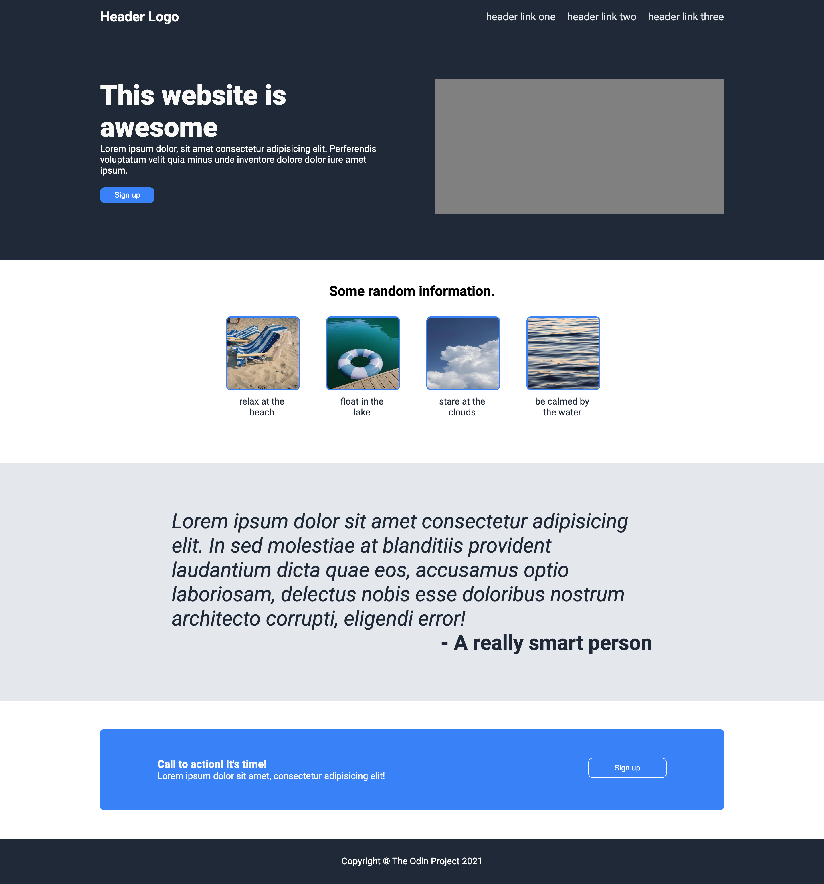

# landing-page

## Table of contents

- [Overview](#overview)
  - [Screenshot](#screenshot)
  - [Links](#links)
- [Built with](#built-with)
- [Author](#author)
- [Acknowledgments](#acknowledgments)

## Overview

This homepage was completed as part of the Flexbox Module on The Odin Project. I was given an image and basic styling for the page and was asked to re-create it on my own. No files were provided. 

### Screenshot

### Links

- Solution URL: [https://github.com/kpuzzonia/odin-landing-page](https://github.com/kpuzzonia/odin-landing-page)
- Live Site URL: [https://kpuzzonia.github.io/odin-landing-page/](https://kpuzzonia.github.io/odin-landing-page/)

### Built with

- Semantic HTML5 markup
- CSS 
- Flexbox

## Author

- Linkedin - [Kari Puzzonia](https://www.linkedin.com/in/kari-puzzonia/)
- Instagram - [@codewithkari](https://www.instagram.com/codewithkari/)

## Acknowledgments

The images used in this project were downloaded from [Dupe Photos](https://dupephotos.com/home).

